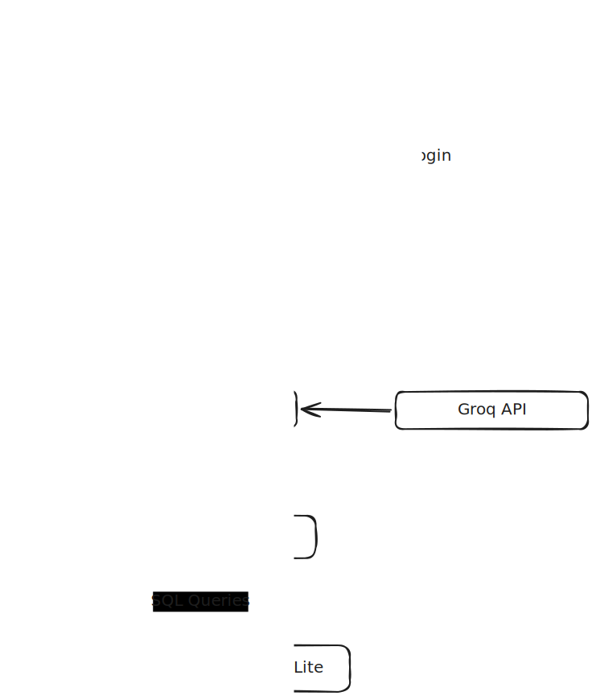

# Project Overview

## Approach

The solution is a conversational chatbot that manages meeting room bookings through natural language. Users authenticate, then interact with an AI assistant that understands requests like "Book Room B tomorrow at 2pm for 4 people" and translates them into structured operations against a booking store.

The key architectural decision was to keep **all business logic in the booking store layer**, not in the LLM. The agent's tools enforce every constraint (capacity, overlap, 30-min slots, 3-hour max) deterministically, so the LLM cannot accidentally create an invalid booking even if it misunderstands a request. The LLM only decides *which tool to call and with what arguments* — the tools themselves are the source of truth.

## Component Diagram

The diagram shows the full request flow: the user authenticates via `auth.py`, then sends chat messages through `app.py` (Streamlit) to `agent.py` (LangGraph ReAct agent), which calls the Groq API (Llama 3.3) to decide which tools to invoke. Tool calls are handled by `tools.py` closures, which delegate all persistence and validation to `booking_store.py` (SQLite).

## Technology Choices

| Component | Choice | Reason |
|---|---|---|
| LLM provider | Groq | Free, no credit card, fast inference, OpenAI-compatible |
| LLM model | llama-3.3-70b-versatile | Strong tool-calling support, free on Groq |
| Agent framework | LangChain (ReAct) | Explicit reasoning trace, straightforward tool integration |
| UI | Streamlit | Minimal code for a functional chat interface |
| Storage | SQLite | Zero-dependency persistence, no external database service |
| Deployment | Railway | Free tier, mentioned in the challenge spec, auto-detects Python |

## Key Decisions

**Why enforce constraints in tools, not the system prompt?**
Relying on the LLM to "remember" that max duration is 3 hours would be fragile. The `booking_store.py` layer validates every constraint and returns a structured error if violated, which the agent relays to the user. This makes the system reliable regardless of how the LLM interprets the conversation.

**Why ReAct over a simpler function-calling loop?**
The ReAct pattern (Reason → Act → Observe) gives the LLM space to chain multiple tool calls in one turn. For example, a user asking "What's available tomorrow morning for 5 people?" may trigger `list_available_rooms` followed by clarifying questions before `create_booking` — all in a single conversational exchange.

**Why `current_user` via closure, not as a tool parameter?**
Injecting the logged-in user into tool closures at session start means the LLM never sees or manipulates the user identity. This prevents prompt injection attacks where a malicious message might try to impersonate another user.

**Why SQLite over in-memory dict?**
SQLite survives Streamlit reruns and app restarts within a deployment session, which in-memory state does not. The trade-off is that Railway's free tier uses an ephemeral disk, so bookings reset on redeploy — this is acceptable for a demo and is documented here.

## Challenges

**Slot alignment validation**: Ensuring start times fall on 30-minute boundaries and durations are exact multiples required careful datetime arithmetic. Solved by checking `minute % 30 == 0` and `duration_minutes % 30 == 0` in `_validate_booking`.

**History management**: LangChain's ReAct agent doesn't natively maintain conversation memory across `invoke` calls. Solved by prepending the last 10 messages as text to the user's input, giving the LLM enough context without hitting token limits.

**Tool binding per user**: LangChain tools are module-level objects, but each user's session needs tools bound to a different `current_user`. Solved with `make_tools(current_user)` — a factory function that creates fresh `@tool`-decorated closures per session.
